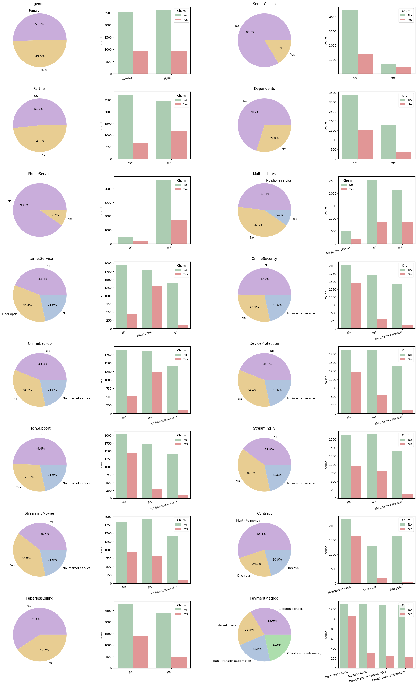
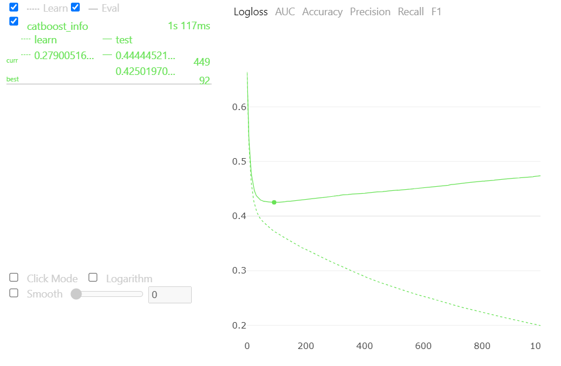
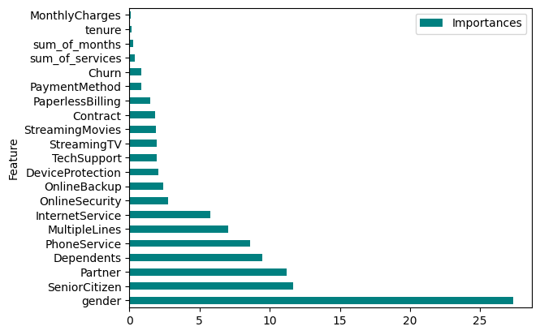

# Telco Customer Chun
[Kaggle dataset](https://www.kaggle.com/datasets/blastchar/telco-customer-churn)

**GOAL:** predict behavior to retain customers.  

---
## Architecture


#### EDA

The features:
1. gender (Male, Female)
2. SeniorCitizen (Yes, No)
3. Partner (Yes, No)
4. Dependents (Yes, No)
5. tenure
6. PhoneService (Yes, No)
7. MultipleLines (Yes, No, No phone service)
8. InternetService (DSL, No, Fiber optic)
9. OnlineSecurity (Yes, No, No internet service)
10. OnlineBackup (Yes, No, No internet service)
11. DeviceProtection (Yes, No, No internet service)
12. TechSupport (Yes, No, No internet service)
13. StreamingTV (Yes, No, No internet service)
14. StreamingMovies (Yes, No, No internet service)
15. Contract (Month-to-month, One year, Two year)
16. PaperlessBilling (Yes, No)
17. PaymentMethod (Bank transfer (automatic), Mailed check, Electronic check, Credit card (automatic))
18. MonthlyCharges
19. TotalCharges
20. Churn



- `gender` - gender does not affect the client's decision
- `Senior Citizen` - older people are more likely to refuse services
- `Partner` & `Dependents` - clients in relationships, as well as clients with children, are less likely to refuse services. Perhaps the company will present favorable family tariffs
- `InternetService` - customers with fiber optic more often refuse services. Customers who do not use the Internet very rarely refuse
- `OnlineSecurity`, `OnlineBackup` & `DeviceProtection` - clients who use protection systems, as well as those who use cloud storage, are more likely to refuse. Competitors also have favorable package offers with additional services
- `TechSupport` -  customers who do not contact technical support are more likely to refuse
- `Contract` - logical, clients with a short-term contract leave more often
- `PaperlessBilling` & `PaperlessBilling` - customers who receive and pay bills in a conservative way are less likely to change service providers
- Clients who have about 3-6 services most often churn.

### CatBoost

Plot created with:
```python
cat_model = CatBoostClassifier(verbose=False,
                               random_state=RANDOM_SEED,
                               custom_loss=['AUC', 'Accuracy',  'Precision', 'Recall', 'F1'])
cat_model.fit(X_train, y_train,
              eval_set=(X_test, y_test),
              plot=True)
```


- After the 92nd iteration, overfitting begins, the logloss value is 0.42.
- The AUC value at the 108th iteration is 0.8373. After about the 300th iteration the AUC value less than 0.8.
- Max value of accuracy at the 330th iteration (0.79). Also at about 50-500 iterations the value is around 0.79, then decreases slightly.
- The maximum value of precision is fixed at the 7th iteration (0.66), during the first 500 iterations it is around 0.63, then drops rapidly.
- The value of the recall at the 450th iteration is 0.52.
- The F1-score at the 479th iteration is 0.57.

Default value:
- `Learning Rate` - 0.04697500169277191
- `subsample` - 0.800000011920929
- `depth` - 6
- `min_data_in_leaf` - 1
- `max_leaves` - 64

Obviously, 1000 default iterations is too much for this data. It semms the optimal number is no more than **500**
<br/> Since the model is starting to overfitting, the `Learning Rate` is optimal in the range **[0.01, 0.02, 0.03, 0.04, 0.05]**

### CatBoost with Optuna

Total metrics:
|            | Default CatBoost | CatBoost tuned with Optuna |
|------------|------------------|----------------------------|
|  Accuracy: | 0.7886           | 0.7929                     |
| Precision: | 0.4938           | 0.4991                     |
|    Recall: | 0.6310           | 0.6422                     |
|  F1_score: | 0.5540           | 0.5617                     |

### Feature Importance
